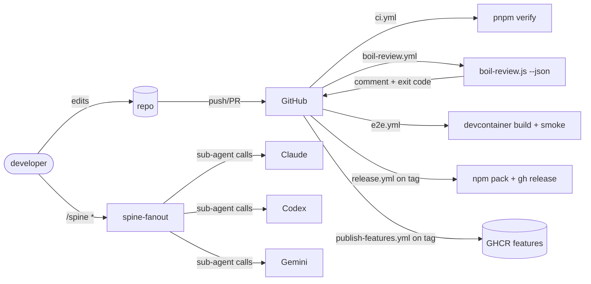

# Architecture

> High-level design of the harness-template monorepo. For the philosophy
> behind the review system, see [BOIL-THE-OCEAN.md](./BOIL-THE-OCEAN.md).
> For the spawner CLI, see [SPAWNER.md](./SPAWNER.md). For the multi-agent
> spine, see [MULTI-CLAUDE.md](./MULTI-CLAUDE.md).

## Goals

The harness-template exists to answer one question:

> *"How do I bootstrap a new project that already has every guardrail,
> review system, devcontainer feature, and AI-agent integration my team
> needs — without copy-pasting from the last project?"*

The answer is a **template-of-templates**: a single repo that you clone,
configure, and run. It produces a fully-equipped child project on disk,
ready to commit and push.

The seven-package layout below is what makes that possible. Each package
has a sharply-bounded responsibility, and the boundaries are real — we
verify them in CI.

## The seven packages

```
harness-template/
├── packages/
│   ├── boil-review/             (1) static-analysis review engine
│   ├── devcontainer-features/   (2) reusable Dev Container Features
│   ├── prompt-library/          (3) prompts, sub-agent definitions, MCP configs
│   ├── project-spawner/         (4) the `harness-spawn` CLI
│   ├── shared-config/           (5) lint / format / tsconfig presets
│   ├── spine-fanout/            (6) multi-CLI orchestration runtime
│   └── vault-tools/             (7) sops + age secret-management helpers
├── templates/                   reference + per-stack project templates
├── tools/                       repo-level scripts (boil-review wrapper, etc.)
└── docs/                        you are here
```

### 1. `boil-review`

A pluggable static analyzer that enforces the "boil-the-ocean completeness
standard" — see [BOIL-THE-OCEAN.md](./BOIL-THE-OCEAN.md). Rules are pure
functions over a parsed source tree. Outputs JSON consumed by
`tools/boil-review.js` and the `boil-review.yml` workflow.

**Boundary:** depends on `shared-config`. Nothing else may import it
except `tools/` and CI.

### 2. `devcontainer-features`

Reusable [Dev Container Features](https://containers.dev/features) we
publish to GHCR via the `publish-features.yml` workflow. Each feature is
self-contained under `src/<feature-id>/` with `devcontainer-feature.json`
plus an `install.sh`.

**Boundary:** zero JS dependencies. These are shell scripts and JSON.

### 3. `prompt-library`

Versioned prompts, sub-agent markdown files, and MCP server configs. This
is the **only** package the spawner copies into child projects verbatim
(under `.claude/`, `.codex/`, `.gemini/`).

**Boundary:** no executable code. Pure data + markdown.

### 4. `project-spawner`

The `harness-spawn` CLI. Reads a template manifest, prompts the user for
variables, renders templates with EJS, copies in the right slice of
`prompt-library`, and commits the result. See [SPAWNER.md](./SPAWNER.md).

**Boundary:** may read all other packages. May not be imported by any of them.

### 5. `shared-config`

ESLint flat-config preset, Prettier config, base `tsconfig.json`, and the
markdownlint config. Every other package extends from here.

**Boundary:** the bottom of the dependency graph. Imports nothing internal.

### 6. `spine-fanout`

The runtime that turns a single "spine command" (e.g. `/spine plan`) into
parallel calls to specialist sub-agents across multiple CLIs (Claude,
Codex, Gemini). See [MULTI-CLAUDE.md](./MULTI-CLAUDE.md).

**Boundary:** depends on `prompt-library` (for sub-agent definitions) and
`shared-config`. Nothing else.

### 7. `vault-tools`

Thin wrappers around `sops` and `age` for the secret-management workflow.
See [VAULT.md](./VAULT.md). Per-CLI auth flow lives in
[CLI-AUTH.md](./CLI-AUTH.md).

**Boundary:** standalone CLI; depends only on `shared-config`.

## Data and code flow

```
                  ┌──────────────────────────┐
   developer ───▶ │ harness-spawn (CLI)      │ ── reads ──▶ templates/
                  │ packages/project-spawner │
                  └────────────┬─────────────┘
                               │ writes
                               ▼
                  ┌──────────────────────────┐
                  │  spawned child project   │
                  └────────────┬─────────────┘
                               │ contains
                               ▼
   ┌──────────────────┬──────────────────┬─────────────────────┐
   │ .devcontainer/   │ .claude/.codex/  │ scripts/, workflows │
   │  ◀── features ◀──┤  ◀── prompt-lib ─┤  ◀── boil-review    │
   │  (GHCR pull)     │  (verbatim copy) │  (rule library)     │
   └──────────────────┴──────────────────┴─────────────────────┘
```

At runtime *inside* the spawned project, the flow is:



## Why this layout

**Explicit boundaries beat clever sharing.** Every package has one
job and one set of allowed dependencies. The boil-review engine
itself enforces the rule that, e.g., `devcontainer-features` never
imports `project-spawner`.

**Spawner output is a snapshot, not a live link.** The child project
gets a *copy* of `prompt-library` and a *pinned* set of feature
versions. Upstream changes do not silently rewrite working repos.
Re-spawning, or running the upgrade subcommand, is always explicit.

**Three bus stops, not seven.** Code flows through three lanes:
*build-time* (spawner), *container-time* (features), and *agent-time*
(prompt-library + spine-fanout). Each lane has a single owner package
plus its `shared-config` dependency. New code lands in one of these
three lanes or it doesn't land.

**The repo eats its own dog food.** This template repo is itself
spawned-ish: it uses its own `boil-review`, its own devcontainer, and
its own spine commands. If something breaks here, you feel it
immediately, not three projects later.

## Cross-references

- Review system internals: [BOIL-THE-OCEAN.md](./BOIL-THE-OCEAN.md)
- CLI usage: [SPAWNER.md](./SPAWNER.md)
- Multi-agent runtime: [MULTI-CLAUDE.md](./MULTI-CLAUDE.md)
- Secret management: [VAULT.md](./VAULT.md)
- AI CLI auth: [CLI-AUTH.md](./CLI-AUTH.md)
- Project overview: [../README.md](../README.md)
- Contributing: [../CONTRIBUTING.md](../CONTRIBUTING.md)
- Security: [../SECURITY.md](../SECURITY.md)
